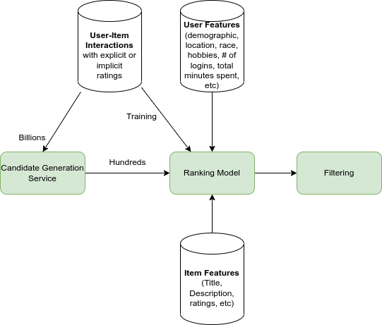

# recsys-mf-ranking
Recommender System for in-depth understanding of how Candidate Generation with Ranking and Filtering works

**[PROJECT FOR STUDYING PURPOSES ONLY]**

## Overview

This Python code implements a recommender system for the MovieLens dataset with three stages. The first stage generates candidates using Matrix Factorization, the second stage is a ranking binary classification model that ingests the embedding space of user's and item features, and the third stage is a filtering part that filters movies that are already seen or manually blocked by the user. The Solution is called as Model based Recommender System with Ranking Recommender System.

## Dependencies
The code requires the following dependencies:

    NumPy: for numerical computing and Matrix Factorization
    Pandas: for data manipulation and analysis
    Scikit-learn: for evaluation metrics
    Keras: for building the binary classification model

## Dataset
The MovieLens dataset is used for this project, which contains ratings and tags of movies from the MovieLens website. The dataset can be downloaded from here https://grouplens.org/datasets/movielens/.

## Code Structure

The code is structured into three main stages:

### Stage 1: Candidate Generation using Matrix Factorization (Optional)

The idea behind using Candidate Generation is decreasing a number of candidates but still generate somewhat relevant content to users. 

Often this stage is implemented using collaborative filtering algorithms such as matrix factorization to generate candidates for the recommender system. 

The inclusion of this step is contingent on the number of candidates provided as input. If the dataset is small, this step may be omitted. However, if a large number of candidates is present, including this step may significantly lengthen training and inference times. This is why this step is called Candidate Generation Model.

Matrix factorization is a technique that factorizes a matrix into two lower-rank matrices. In the context of recommender systems, it is used to factorize the user-item rating matrix into user and item embeddings. The user and item embeddings are then multiplied to generate a predicted rating matrix, which can be used to generate candidate movies for the recommender system.

In the provided code we use `SVD` for explicit ratings, for implicit please refer to `SVD++`

In the provided code, `U`, `S`, and `Vt` are the three matrices obtained by performing singular value decomposition (SVD) on the user-item matrix.

SVD is a matrix factorization technique that is commonly used in recommender systems to decompose a large matrix into smaller matrices. The goal of SVD is to find a low-rank approximation of the user-item matrix that captures the most important information about the users and items.

`U` is a matrix that represents the users in a reduced dimensional space, where the columns of U are the left singular vectors. S is a diagonal matrix that contains the singular values of the user-item matrix, which represent the relative importance of the factors. Vt is a matrix that represents the items in a reduced dimensional space, where the rows of Vt are the right singular vectors.

By multiplying `U`, `S`, and `Vt`, we can reconstruct the original user-item matrix with a lower rank approximation. This allows us to predict the ratings of movies that the user has not yet seen based on the ratings of movies that the user has already seen.

### Stage 2: Ranking Model
let's define why we need Ranking Model if we can make predictions based only on Matrix Factorization. The main reason of using Ranking Model is that you can pass additional features apart user-item-ranking interactions that allow to achieve higher accuracy. The Ranking task can be represented as Binary Classification or as Learning-to-Rank task (list of n-th ranged items for user).

The current stage and approach uses a binary classification model to rank the candidate movies generated by matrix factorization. The binary classification model ingests the embedding space of user's and item features. The binary classification model is implemented using a fully connected neural network in Keras.

Please, Pay attention that this model is created for tutorial purposes and not based on getting the most accurate solution, So grab the architecture idea and not evaluation metrics.

### Stage 3: Filtering
This stage filters out the movies that the user has already seen or manually blocked.

## Ranking Model vs Content-based Reccommender System

Content-based collaborative filtering and ranking binary classification are two different approaches used in recommender systems to suggest items to users.

Content-based collaborative filtering involves using the attributes of the items and the preferences of the users to make recommendations. It recommends items that are similar to those that a user has liked in the past using similarities measures. For example, if a user has liked several romantic movies in the past, the content-based collaborative filtering approach will recommend other romantic movies. This approach focuses on the content of the items and not on the preferences of other users.

Ranking binary classification, on the other hand, involves predicting whether a user will like an item or not based on the historical data of the user's interactions with items. This approach involves training a machine learning model to predict the likelihood of a user liking an item. The model is trained using features such as the user's past interactions with similar items, the item's characteristics, and the context of the recommendation. The output of this approach is a score or ranking of items that the user is likely to prefer.

In summary, content-based collaborative filtering focuses on item attributes, while ranking binary classification focuses on predicting the user's preference based on historical data and features.

## Useful Links 
High level review of different types of RecSys:
- https://thingsolver.com/introduction-to-recommender-systems/

- For someone who is willing to deeply understand the math under SVD
- https://machinelearningmastery.com/singular-value-decomposition-for-machine-learning/
- http://www.diva-portal.org/smash/get/diva2:1214390/FULLTEXT01.pdf

Netflix evolved from Ratings predictions to Ranking Predictions in 2012. 
- https://towardsdatascience.com/deep-dive-into-netflixs-recommender-system-341806ae3b48
- https://netflixtechblog.com/netflix-recommendations-beyond-the-5-stars-part-1-55838468f429
- https://netflixtechblog.com/netflix-recommendations-beyond-the-5-stars-part-2-d9b96aa399f5

Why do traditional offline metrics not correlate with A/B tests? Netflix offline-online testing process 
- https://www.quora.com/What-offline-evaluation-metric-for-recommender-systems-better-correlates-with-online-AB-test-results
- https://netflixtechblog.com/netflix-recommendations-beyond-the-5-stars-part-2-d9b96aa399f5

Twitter RecSys explained
- https://medium.com/data-achilles/twitters-recommendation-algorithm-explained-a46d357315d5

User & Item based Collaborative Filtering in Python
- https://www.geeksforgeeks.org/user-based-collaborative-filtering/
- https://medium.com/grabngoinfo/recommendation-system-user-based-collaborative-filtering-a2e76e3e15c4
- https://medium.com/grabngoinfo/recommendation-system-item-based-collaborative-filtering-f5078504996a

Incorporate additional features with MF. 
P.S Incorporation additional features in Collaborative Filtering is done by combining User/Item-based Collaborative Filtering with Content based Recommender System
- https://towardsdatascience.com/recsys-series-part-4-the-7-variants-of-matrix-factorization-for-collaborative-filtering-368754e4fab5
- https://stats.stackexchange.com/questions/518276/adding-explicit-user-info-to-matrix-factorization#_=_

How to evaluate a Content-based Recommender System
- https://stackoverflow.com/questions/6167855/how-to-evaluate-a-content-based-recommender-system

KNN vs Collaborative Filtering in RecSys. KNN shares some common ideas with Collaborative Filtering, but they are different algorithms.
- https://stackoverflow.com/questions/7742706/k-nearest-neighbour-vs-user-based-nearest-neighbour#_=_

Memory-Based RecSys
- https://www.cs.carleton.edu/cs_comps/0607/recommend/recommender/memorybased.html#:~:text=Memory%2Dbased%20algorithms%20approach%20the,ratings%20for%20the%20active%20user.

Twitter Recommender System
- https://blog.twitter.com/engineering/en_us/topics/open-source/2023/twitter-recommendation-algorithm
- https://github.com/twitter/the-algorithm

Binary Classification Ranking vs Learning-to-Rank
https://chat.openai.com/share/a3a39fe8-4a35-412b-b69a-ffb3ea4d5e97

Tensorflow LTR Ranking
https://www.youtube.com/watch?v=BthUPVwA59s
https://github.com/tensorflow/ranking/tree/master
http://bendersky.github.io/res/TF-Ranking-ICTIR-2019.pdf

